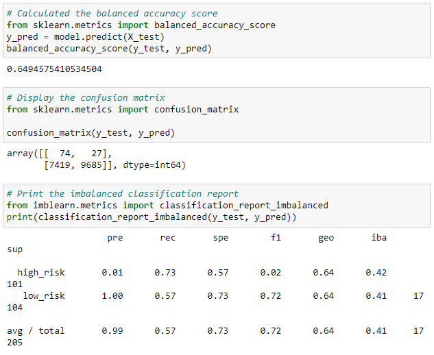
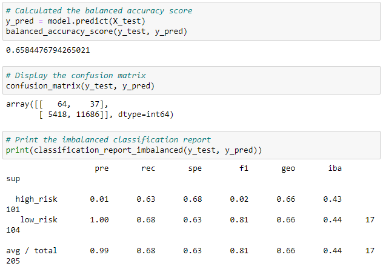
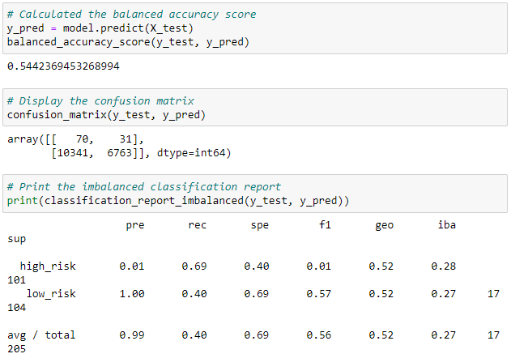
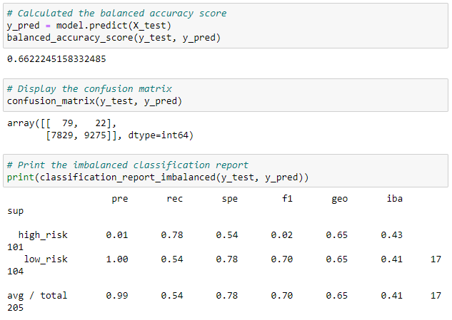
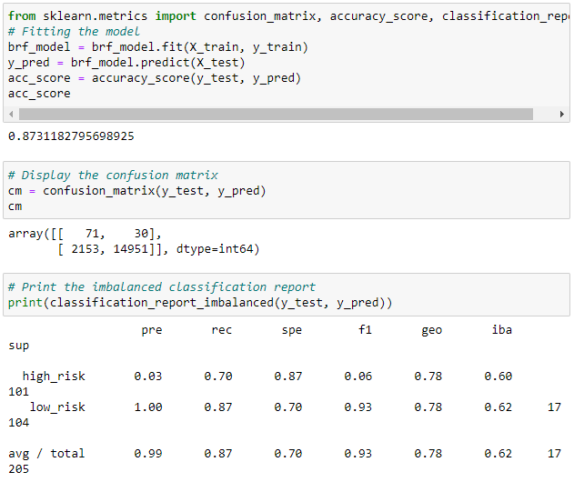
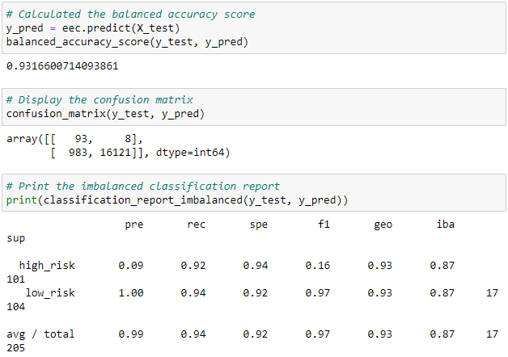

# Credit_Risk_Analysis
## Overview
The purpose of this analysis is to use several different techniques to train and evaluate models to try and identify risky credit loans. We used RandomOverSampling and SMOTE algorithms to oversample the data, ClusterCentroids to undersample the data, and SMOTEENN to over- and undersample the data. We then tried two new algorithms: BalancedRandomForestClassifier and EasyEnsembleClassifier with the same data to compare results.
## Results
Below are the results from each of the models that were used:
### RandomOverSampler
  
 - Balanced Accuracy Score:  
In this model we reported a balanced accuracy score of 65%.
 - Imbalanced Classification Report:  
There is a high_risk precision of just 1% and 73% recall, gives us an f1 score of just 2%.
### SMOTE Oversampling
  
 - Balanced Accuracy Score:  
In this model we reported a balanced accuracy score of 66%.
 - Imbalanced Classification Report:  
There is a high_risk precision of just 1% and 63% recall, gives us an f1 score of just 2%.
### ClusterCentroids Undersampling
  
 - Balanced Accuracy Score:  
In this model we reported a balanced accuracy score of 54%.
 - Imbalanced Classification Report:  
There is a high_risk precision of just 1% and 69% recall, gives us an f1 score of only 1%.
### SMOTEENN Over- and Undersampling
 
 - Balanced Accuracy Score:  
In this model we reported a balanced accuracy score of 66%.
 - Imbalanced Classification Report:  
There is a high_risk precision of just 1% and 78% recall, gives us an f1 score of just 2%.
### BalancedRandomForestClassifier
 
 - Balanced Accuracy Score:  
In this model we reported a balanced accuracy score of 87%.
 - Imbalanced Classification Report:  
There is a high_risk precision of 3% and 70% recall, gives us an f1 score of 6%.
### EasyEnsembleClassifier
 
 - Balanced Accuracy Score:  
In this model we reported a balanced accuracy score of 93%.
 - Imbalanced Classification Report:  
There is a high_risk precision of 9% and 92% recall, gives us an f1 score of 16%.
## Results Summary
All of the models had very low precision in detecting high-risk credit. Even though the EasyEnsembleClassifier had 92% sensitivity for high-risk, it still only had 9% precision. While this may detect most of the high-risk credit accounts, it is also going to disqualify a **lot** of low-risk credit accounts from being approved for a loan. Because of this, I would not reccommend any of these models for credit checks; as the lender will lose more money to this modewl in missed opportunities than they would to customers that default on their loan.
